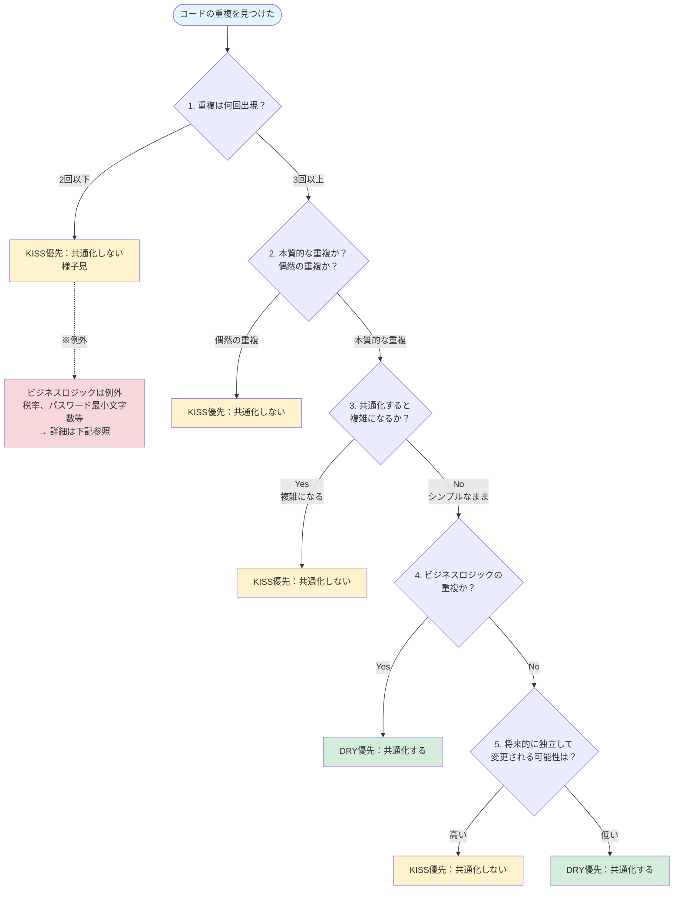

# DRY vs KISS 判断ガイド

## 概要

DRY原則（Don't Repeat Yourself）とKISS原則（Keep It Simple, Stupid）は、どちらも重要な設計原則ですが、時として競合することがあります。このガイドでは、両者が競合した際の判断基準とフローチャートを提供します。

---

## 基本原則

### 優先順位
```
KISS > DRY（過度な抽象化を避ける場合）
DRY > KISS（ビジネスロジックの重複がある場合）
```

### 3回ルール
**重複が3回未満なら、DRYよりもKISSを優先し、共通化を待つ。**

---

## 判断フローチャート



---

## 判断基準の詳細

### 1. 重複の回数チェック（3回ルール）

**2回以下の重複 → KISS優先**
- まだ共通化しない
- 様子を見る
- 3回目が出現したら共通化を検討

**3回以上の重複 → 共通化を検討**
- 次の判断基準に進む

#### 例

```typescript
// ❌ 2回の重複で共通化（KISS違反）
function formatUserName(user: User): string {
  return `${user.firstName} ${user.lastName}`;
}

function formatAuthorName(author: Author): string {
  return `${author.firstName} ${author.lastName}`;
}

// 無理に共通化すると...
function formatName(entity: User | Author): string {
  return `${entity.firstName} ${entity.lastName}`;
}
// → 型が複雑になる

// ✅ 2回程度なら重複を許容（KISS優先）
// そのまま2つの関数を残す
```

---

### 2. 本質的な重複 vs 偶然の重複

#### 本質的な重複（DRY優先）
同じビジネスルールや知識の表現

```typescript
// ✅ 本質的な重複 → 共通化すべき
// 「消費税率10%」というビジネスルール
function calculateOrderTotal(items: Item[]): number {
  return items.reduce((sum, item) => sum + item.price, 0) * 1.1;
}

function calculateInvoiceTotal(invoice: Invoice): number {
  return invoice.amount * 1.1;  // 同じ税率！
}

// → 共通化
const TAX_RATE = 0.1;

function applyTax(amount: number): number {
  return amount * (1 + TAX_RATE);
}
```

#### 偶然の重複（KISS優先）
たまたまコードが似ているだけで、意味が異なる

```typescript
// ✅ 偶然の重複 → 共通化しない
// 注文の合計金額
function calculateOrderTotal(items: OrderItem[]): number {
  return items.reduce((sum, item) => sum + item.price * item.quantity, 0);
}

// 在庫の評価額
function calculateInventoryValue(products: Product[]): number {
  return products.reduce((sum, p) => sum + p.cost * p.stock, 0);
}

// → 無理に共通化すると逆に複雑になる
```

#### 2回の重複における判断基準

**2回の重複でも共通化すべき（DRY優先）:**
- ✅ **ビジネスルール**: 税率、最小文字数、有効期限、割引率など
  - 変更時の修正漏れが重大な問題になる
  - 例: パスワードの最小文字数が複数箇所にある場合
- ✅ **設定値やマジックナンバー**: システム全体で統一すべき値
  - 例: API タイムアウト時間、ページネーションのデフォルト件数
- ✅ **バリデーションロジック**: 同じ検証ルールが複数箇所で使われる
  - 例: メールアドレスの形式チェック

**2回の重複では共通化不要（KISS優先）:**
- ✅ **偶然の重複**: たまたまコードが似ているだけで意味が異なる
  - 例: ユーザー名のフォーマットと著者名のフォーマット
- ✅ **ドメインが異なる重複**: 別のドメインに属する処理
  - 例: 注文の割引計算とカートの割引計算（閾値や率が将来的に変わる可能性）
- ✅ **将来的に独立して変更される可能性が高いもの**
  - 例: ユーザー登録メールとパスワードリセットメール（内容が独立して変わる）

**迷った場合の原則:**
- 3回目が出現するまで待つ（3回ルール）
- ビジネスロジックかどうかを基準に判断
  - ビジネスロジック → 2回でも共通化
  - それ以外 → 3回まで待つ

---

### 3. 共通化による複雑さの増加

#### 共通化で複雑になる場合（KISS優先）

```typescript
// ❌ 共通化で複雑になる例
function processData(
  data: any,
  type: 'user' | 'order' | 'product',
  options: ProcessOptions
): any {
  if (type === 'user') {
    // ユーザー固有の処理
  } else if (type === 'order') {
    // 注文固有の処理
  } else {
    // 商品固有の処理
  }
  // 複雑な分岐が増える...
}

// ✅ 分けた方がシンプル（KISS優先）
function processUser(user: User, options: UserOptions): ProcessedUser {
  // ユーザー処理
}

function processOrder(order: Order, options: OrderOptions): ProcessedOrder {
  // 注文処理
}

function processProduct(product: Product, options: ProductOptions): ProcessedProduct {
  // 商品処理
}
```

#### 共通化してもシンプルな場合（DRY優先）

```typescript
// ✅ 共通化してもシンプル（DRY優先）
// Before
function validateUserEmail(email: string): boolean {
  return /^[^\s@]+@[^\s@]+\.[^\s@]+$/.test(email);
}

function validateAdminEmail(email: string): boolean {
  return /^[^\s@]+@[^\s@]+\.[^\s@]+$/.test(email);
}

// After
function isValidEmail(email: string): boolean {
  return /^[^\s@]+@[^\s@]+\.[^\s@]+$/.test(email);
}
```

---

### 4. ビジネスロジックの重複

**ビジネスロジック（ドメインルール）の重複 → DRY優先**

ビジネスルールが複数箇所に散在すると、変更時の修正漏れが発生するリスクが高い。

```typescript
// ❌ ビジネスロジックの重複（危険）
class OrderService {
  canCancel(order: Order): boolean {
    return order.status === 'pending' &&
           order.createdAt > Date.now() - 24 * 60 * 60 * 1000;
  }
}

class OrderController {
  cancelOrder(orderId: string) {
    const order = this.getOrder(orderId);
    // 同じビジネスルールが重複！
    if (order.status === 'pending' &&
        order.createdAt > Date.now() - 24 * 60 * 60 * 1000) {
      // キャンセル処理
    }
  }
}

// ✅ ビジネスロジックは1箇所に（DRY優先）
class Order {
  canCancel(): boolean {
    const CANCEL_DEADLINE_HOURS = 24;
    const deadlineMs = CANCEL_DEADLINE_HOURS * 60 * 60 * 1000;
    return this.status === 'pending' &&
           this.createdAt > Date.now() - deadlineMs;
  }
}
```

---

### 5. 将来的な変更の独立性

#### 独立して変更される可能性が高い → KISS優先

```typescript
// ✅ 将来的に独立して変更される可能性が高い → 分けておく
// ユーザー登録時のメール送信
function sendUserRegistrationEmail(user: User) {
  const subject = 'ようこそ！';
  const body = `${user.name}さん、登録ありがとうございます。`;
  sendEmail(user.email, subject, body);
}

// パスワードリセットのメール送信
function sendPasswordResetEmail(user: User, token: string) {
  const subject = 'パスワードリセット';
  const body = `リセットトークン: ${token}`;
  sendEmail(user.email, subject, body);
}

// → 今は似ているが、将来的に独立して変わる可能性が高い
// 無理に共通化すると、後で分離する手間がかかる
```

#### 常に一緒に変更される → DRY優先

```typescript
// ✅ 常に一緒に変更される → 共通化すべき
// 価格表示のフォーマット（通貨記号は常に統一）
const CURRENCY_SYMBOL = '¥';

function formatPrice(price: number): string {
  return `${CURRENCY_SYMBOL}${price.toLocaleString()}`;
}

// すべての価格表示で使用
```

---

## 具体的な判断例

### 例1: フォーマット関数の重複（2回）

```typescript
// 状況: 2箇所で似たフォーマットが必要
function formatUserDisplay(user: User): string {
  return `${user.name} (${user.email})`;
}

function formatAdminDisplay(admin: Admin): string {
  return `${admin.name} (${admin.email})`;
}
```

**判断フロー**:
1. 重複は何回？ → **2回**
2. **結論: KISS優先で共通化しない**

理由: 3回ルールに満たない。3回目が出現したら共通化を検討。

---

### 例2: バリデーションロジックの重複（3回）

```typescript
// 状況: 3箇所で同じバリデーション
function validateUserAge(age: number): boolean {
  return age >= 0 && age <= 150;
}

function validateEmployeeAge(age: number): boolean {
  return age >= 0 && age <= 150;
}

function validateCustomerAge(age: number): boolean {
  return age >= 0 && age <= 150;
}
```

**判断フロー**:
1. 重複は何回？ → **3回**
2. 本質的な重複か？ → **Yes**（同じバリデーションルール）
3. 共通化すると複雑？ → **No**
4. ビジネスロジック？ → **Yes**
5. **結論: DRY優先で共通化する**

```typescript
// ✅ 共通化
const MIN_AGE = 0;
const MAX_AGE = 150;

function isValidAge(age: number): boolean {
  return age >= MIN_AGE && age <= MAX_AGE;
}
```

---

### 例3: 似ているが異なるドメインロジック

```typescript
// 状況: 注文とカートで似た処理
function calculateOrderDiscount(order: Order): number {
  if (order.items.length >= 5) {
    return order.total * 0.1;  // 10%割引
  }
  return 0;
}

function calculateCartDiscount(cart: Cart): number {
  if (cart.items.length >= 3) {  // 閾値が異なる！
    return cart.total * 0.05;    // 割引率も異なる！
  }
  return 0;
}
```

**判断フロー**:
1. 重複は何回？ → **2回**
2. **結論: KISS優先で共通化しない**

追加理由:
- 閾値と割引率が異なる（偶然の重複に近い）
- 将来的に独立して変更される可能性が高い

---

### 例4: 設定値の重複（ビジネスルール）

```typescript
// 状況: 複数箇所で同じ設定値
class UserService {
  validatePassword(password: string): boolean {
    return password.length >= 8;  // 最小文字数
  }
}

class PasswordResetService {
  validateNewPassword(password: string): boolean {
    return password.length >= 8;  // 同じ最小文字数！
  }
}
```

**判断フロー**:
1. 重複は何回？ → **2回**
2. 本質的な重複か？ → **Yes**（同じビジネスルール）
3. ビジネスロジック？ → **Yes**
4. **結論: 2回でもDRY優先で共通化する**

理由: ビジネスルール（パスワードの最小文字数）なので、変更時に修正漏れがあると危険。

```typescript
// ✅ 共通化
const PASSWORD_MIN_LENGTH = 8;

function isValidPasswordLength(password: string): boolean {
  return password.length >= PASSWORD_MIN_LENGTH;
}
```

---

## まとめ

### DRY優先すべきケース

- ✅ **ビジネスロジック（ドメインルール）の重複**
- ✅ 重複が3回以上
- ✅ 共通化してもシンプルさを保てる
- ✅ 常に一緒に変更されるコード
- ✅ 設定値やマジックナンバーの重複

### KISS優先すべきケース

- ✅ **重複が2回以下**（3回ルール）
- ✅ 偶然の重複（たまたま似ているだけ）
- ✅ 共通化すると複雑になる
- ✅ 将来的に独立して変更される可能性が高い
- ✅ ドメインが異なる重複

### 迷った時のチェックリスト

実装時に以下を確認:

- [ ] 重複は3回以上出現しているか？
- [ ] これは本質的な重複か、偶然の重複か？
- [ ] 共通化すると複雑になるか？
- [ ] ビジネスロジックの重複か？
- [ ] 将来的に独立して変更される可能性はあるか？

**原則**: 迷ったら**KISS優先**。共通化は必要になってから行う（YAGNI）。

---

## 関連リソース

- [DRY原則](dont-repeat-yourself.md)
- [KISS原則](kiss.md)
- [YAGNI原則](yagni.md)
- [テスト駆動開発の原則](test-driven-development.md) - Refactor段階での適用
